This tutorial describes the basic usage of git, a version control system to
track code changes among yourself and your collaborators.

Contents:
* [Accessing Khoury Github](#khoury-github)
* [Gitting Started!](#gitting-started)
* [Basic Commands](#basic-commands)
* [Branching](#branching)
* [Merging and Various Errors](#merging-and-various-errors)
* [More Advanced Commands and Fun Stuff](#more-advanced-commands-and-fun-stuff)

If you run into any difficulties following any of these steps, please post
(in a non-private question) on Piazza.

# Accessing Khoury Github

We recommend using the Khoury Github for this class, as it will be the site
you use for your final project. You can login with your Khoury account here:
https://github.ccs.neu.edu/login. If you do not already have a Khoury account,
you can request one at https://my.khoury.northeastern.edu/account/apply. Once you do
this, you will be emailed your account information when it is approved by the
IT department.

# Gitting Started!

Git is a version control system that lets you share versions of code remotely
with other collaborators (or have a remote version you can save and access from
any computer). The central platform that we will be using is an online service
called Github (other services also exist, like GitLab). You can create your own
account online at https://github.com/, or use the Khoury Github mentioned above.
Again, we recommend using the Khoury Github, as this will be what you will be
using for your final projects.

Once you login, you can create a new repository (which is a another name for
a git enabled folder) by clicking "New" button in the upper left corner:
    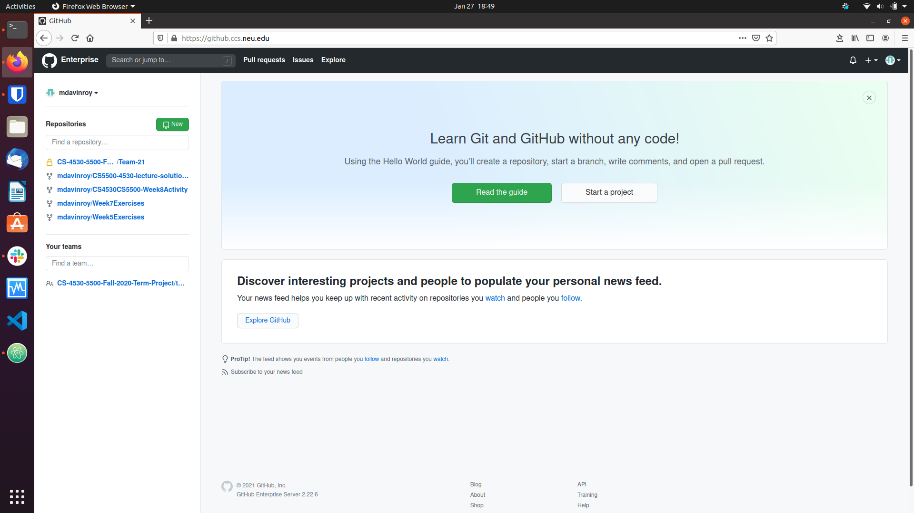

Use the screen to enter a new folder (repo) name. For example, I chose
/test-repo. Additionally select Public or Private depending on who you
want to be able to see your project and click add README as well. Then click
"create repository".
    

This should put you on the webpage of the new repository you just created!
    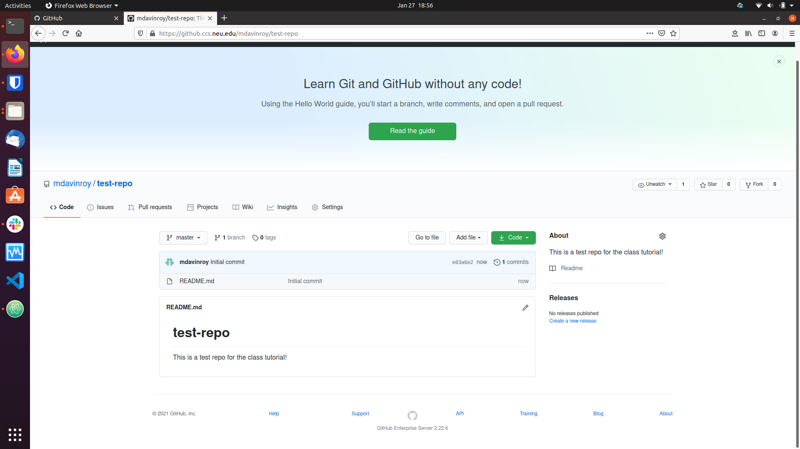

To get this repository on your local computer, you will do a process called
cloning. Two steps are needed before you can do this process:

1. You need to install git locally on your computer.
2. You need to add an ssh key to your Github page (or you can clone using
  https). For context, using an ssh key allows you to authenticate your
  computer with Github automatically using a cryptographic protocol. This
  process tends to make working with git more smooth when developing your code, as you are automatically authenticated when you start up a new session
  and don't have to type in your username and password every time you want to
  sync the Github repository with your local computer.

For step one,
- If you are on a linux machine, type `sudo apt-get update` and then
type `sudo apt-get install git`.
- If you are on a mac, type `git --version`. If it is already installed, it will print out the current version (and you're ready to go!). If it is not already installed, you will be prompted with the option to install Git by installing the XCode Command Line Tools - follow the prompts to install XCode Command Line Tools, and when you're done, you'll have git (along with several other useful tools)
- If you are on a windows machine, follow the steps below:
    1. Download the git installer from the git-scm [website](https://git-scm.com/downloads)
        - 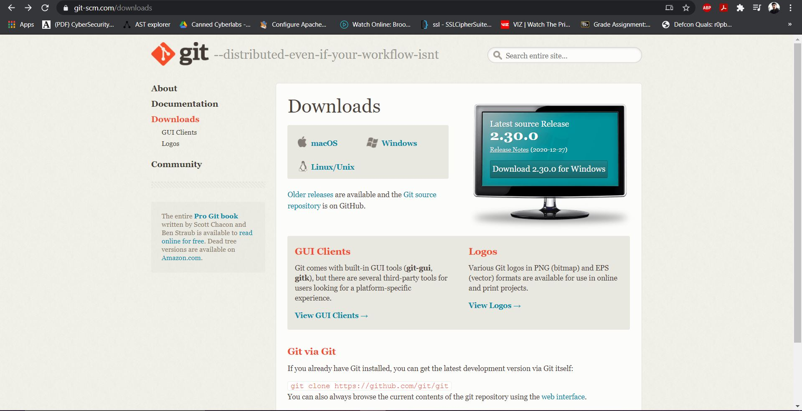
    2. Run the installer and click yes on the windows prompt to allow installation.
    3. Click next on the information page.
        - 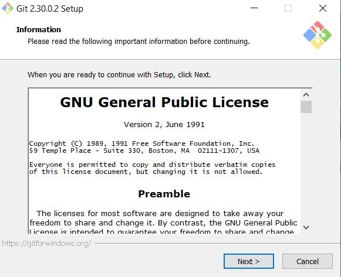
    4. Select the destination folder for installation and click next.
        - 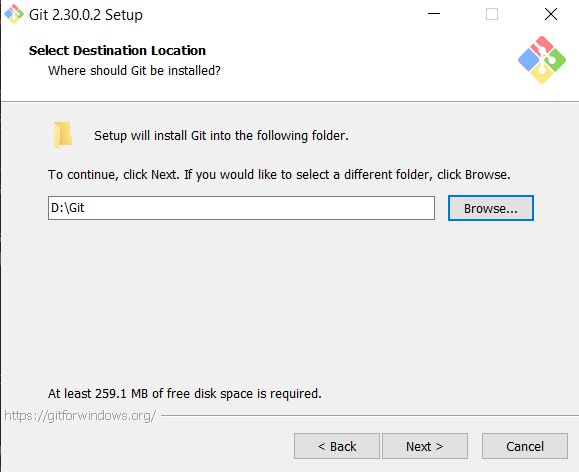
    5. Select all components and click next.
        - 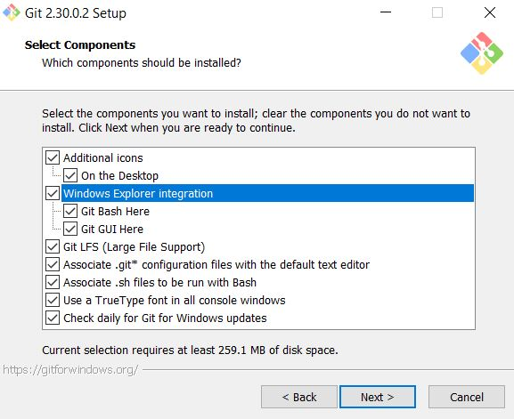
    6. Click next on select start menu folder.
        - 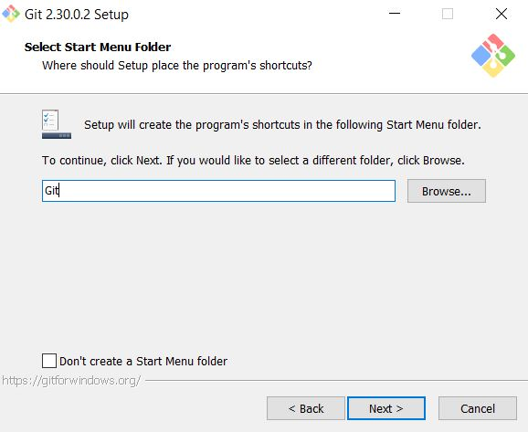
    7. Select the editor of choice for Git (I've kept the default Vim.JPG) and click next.
        - 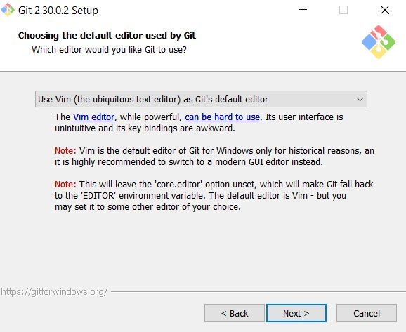
    8. Select "Let git decide" for the default branch and click next.
        - 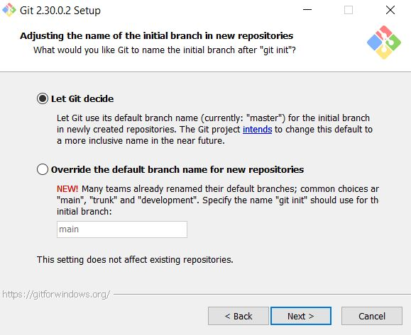
    9. Select "Git from the command line and also 3rd party software" and click next.
        - 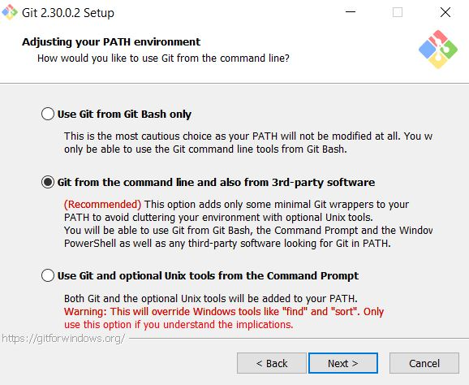
    10. Select "Use OpenSSL library" and click next.
        - 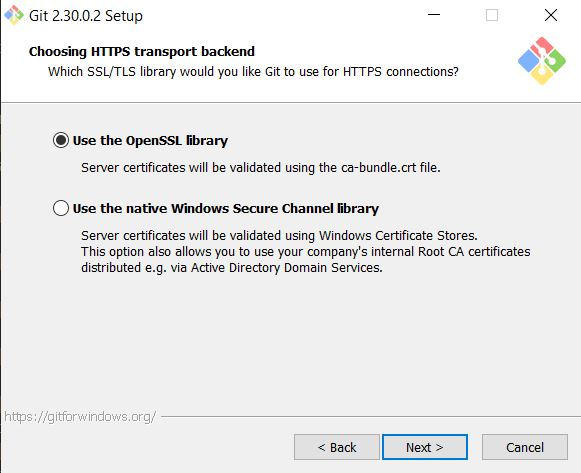
    11. Select "Checkout windows-style, commit unix-style line endings" and click next.
        - 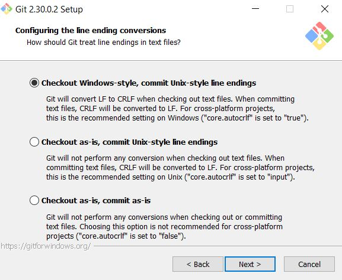
    12. Select "Use MinTTY" and click next.
        - 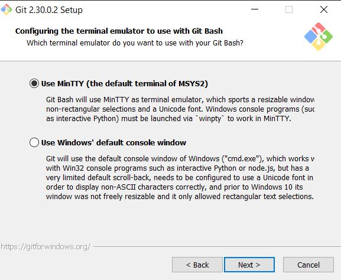
    13. Select "default" and click next.
        - 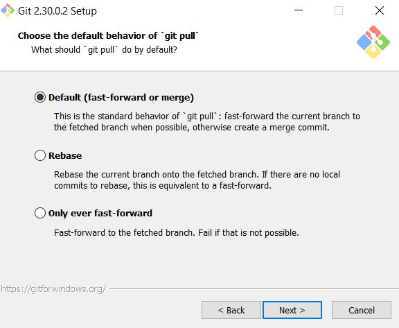
    14. Select "Git Credential Manager Core" and click next.
        - 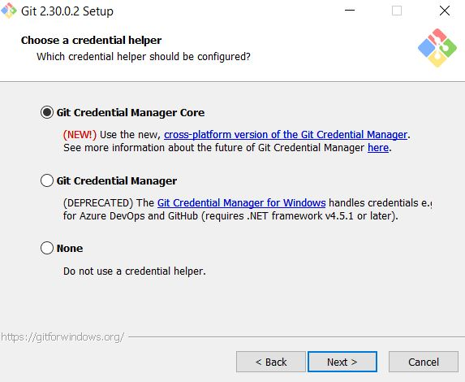
    15. Enable both options and click next.
        - 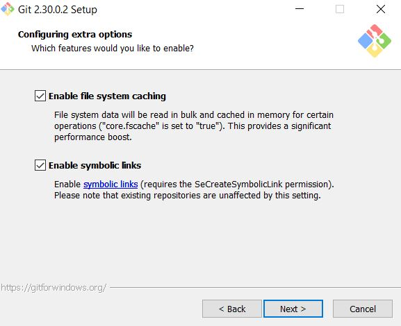
    16. Select "Enable support for experimental consoles" and click Install.
        - 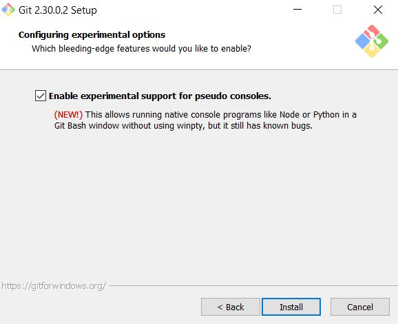
    17. Git has now been installed. Click finish to exit
        - 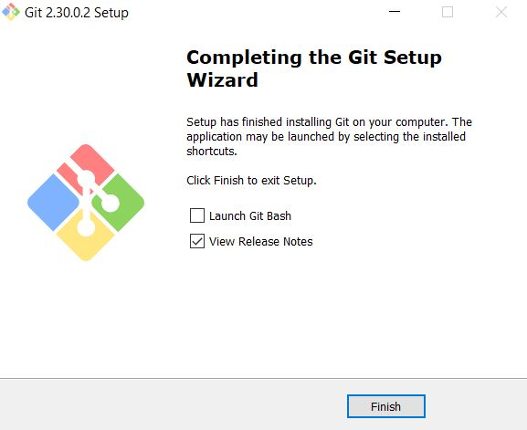
- To verify the installation of git:
    1. Open a terminal (cmd/powershell)
    2. Run the command `*git --version*`
    3. You should see the version of git installed
        - 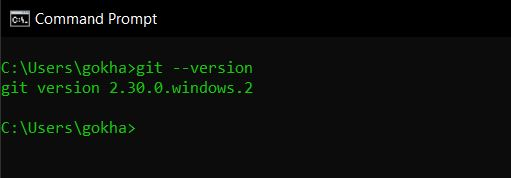

Setting your SSH key on Windows:
1. Open git bash
2. Run the command: `*ssh-keygen*`
    - Hit enter for all options and an RSA key-pair will be generated!
    - However, it is a good idea to set a passphrase.
    - 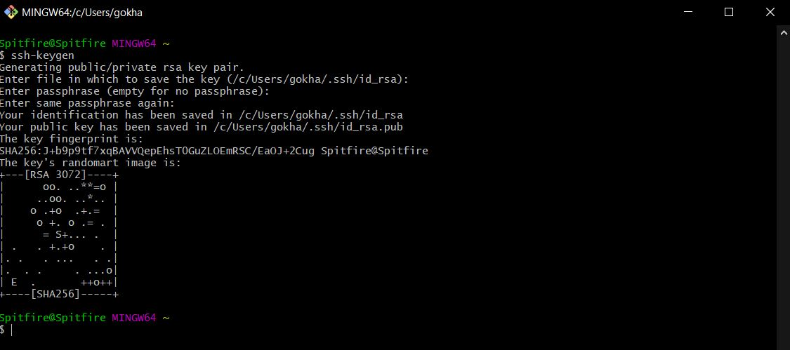

After you install git, navigate to your home directory and type `ssh-keygen`.
Press enter for all options, and optionally enter a password when prompted. It
is less secure to not enter a password, but many people opt not to have one
when working on a personal computer to make their workflow easier. Next, on
the Github website, access your account settings, by clicking on the little
icon on the top right and selecting `Settings` from the drop-down menu.
    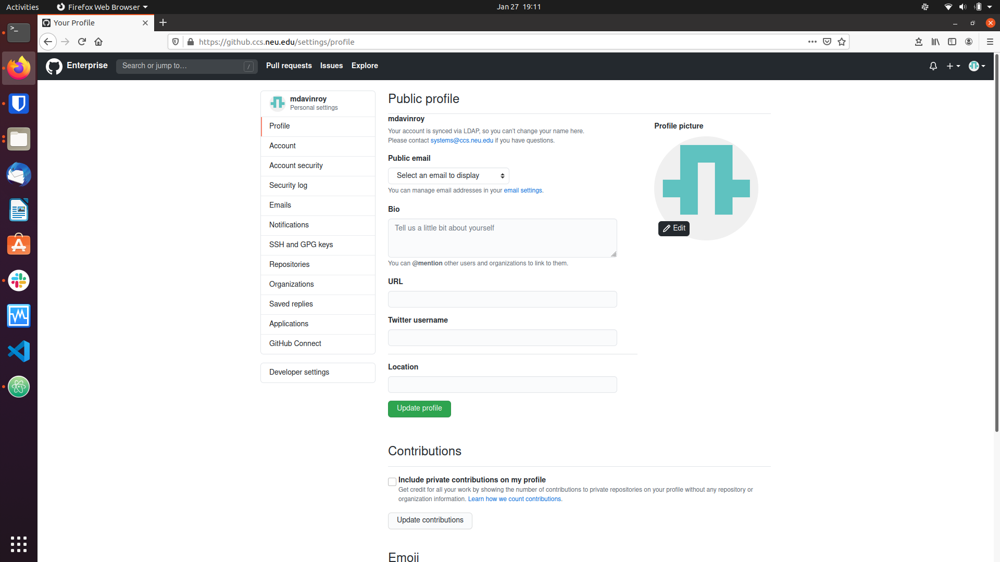

Click on the `SSH and GPG keys` tab and click `New SSH-key`. Navigate to your
home directory and type `cat .ssh/id_rsa.pub`. This is your public key, make
sure not to access `.ssh/id_rsa` instead, as this is your private key. Copy
and paste this public key into the box, give it a recognizable title (something
that you would recognize as your computer) and click `Add SSH key`.
    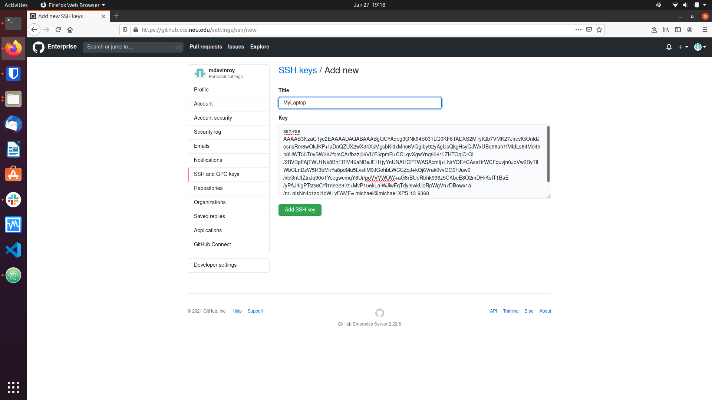

After you add your ssh key, you are ready to clone the repository locally!
Navigate back to your repo page and locate the green `Code` button with an
arrow. Make sure it says `Clone with SSH` and click the clipboard to copy
the location.
    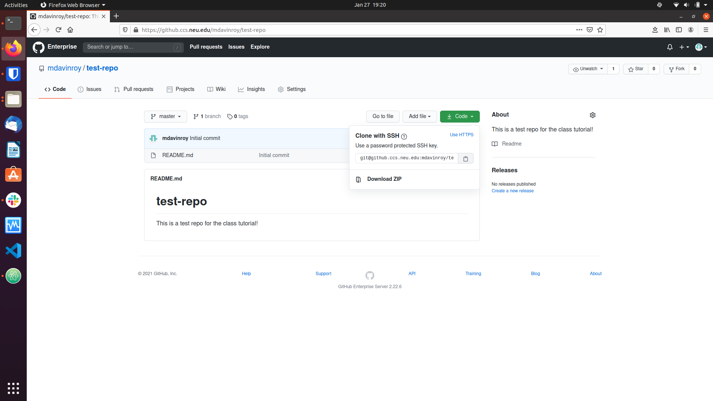

Navigate back to your terminal and type
`git clone [copied location]`. Hit enter to accept the SSH prompt (this will
only happen the first time you access a repo). This will clone your repo
locally for you to edit! If you encounter an error saying you do not have
access rights, you have messed something up in adding your ssh key. Retry
the steps for generating and adding the public key to your Github. Further
information for troubleshooting and/or setting up an ssh key on other systems
as needed can be found at: https://docs.github.com/en/github/authenticating-to-github/connecting-to-github-with-ssh.

# Basic Commands

There are a few basic command you need to know to use git effectively.
The basic workflow of working with git is when you resume working on a project,
you type `git pull` in the github enabled folder. This will sync your local
branch with the remote server (i.e. the `Master` branch,
implicitly selected or explicitly  denoted `origin master`).
Then you work on your code saving normally. When you are done (or want to
create a checkpoint), you first add your code, commit it (with a message),
and then push it. To check on the status of your commits, you can type
`git status`. This command will show you what files you have edited locally
that are not up to date with the master branch in red. To add them, type
`git add [insert name of file]` for each file to add. Of note, you can tab
complete the file name and use regular expressions to add more than one file.
After you add a file, it will turn green in the `git status` menu.
Then, you type `git commit -m "[Some explanatory message]"`. Commits are how
git tracks versions of the code. Finally, you type `git push` and this should
update the master branch (seen on the website) with your code changes.

For review, when working on code you:
1. `git pull`
2. Work on your code
3. `git add [file name]`
4. `git commit -m "[Descriptive message]"`
5. `git push`

# Branching

The above workflow is great when you are the only developer on a project.
Now we will discuss an important concept when working with other developers:
branching. When adding code to a shared code-base, it is good practice to create
a branch to work on locally, using the flow above, and when you want to combine
it with the existing code (called merging), to open what is called a
`Pull Request`. This allows for code review (as someone else can approve the
request), helps prevent nasty merging issues (as you can see how the branches)
will merge before accepting the request, and keeps feature development
separate from each other for good development modularity. To get an intuitive
idea for what is going on, review this short graphic from github:
https://guides.github.com/introduction/flow/.

To create a branch, you can type `git checkout -b [name of new branch]`. This
is shorthand for `git branch [name of new branch]` followed by
`git checkout [branch name]`. To see all the branches for the repo, type
`git branch` with no arguments. To switch between branches, type
`git checkout [branch name]`. When you are on a branch, you can pull, add,
commit, and push like a normal workflow above. When you are ready to merge
with the master branch, you can either open a pull request or (and this is
not recommended because it can cause merge conflicts that are difficult to
resolve and can mess with other people's code) merge directly with the master
branch. To open a pull request, navigate to the repo on the github website and
select your branch from the branch drop down menu (on top of where the files
are listed on the left side; master will likely be selected as default).
Above the files should say "This branch is x commits ahead or behind master".
To the left of that select pull request.
    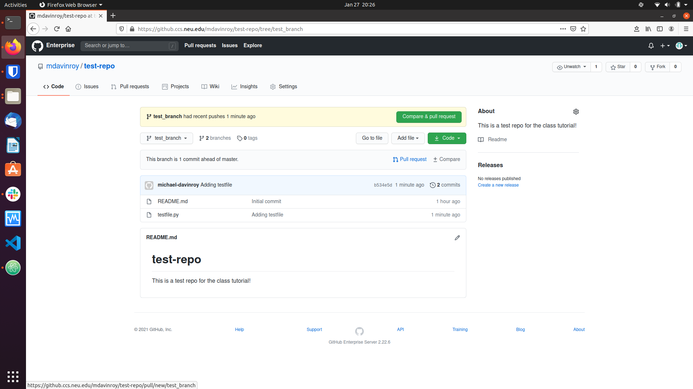

Add an optional comment and select
`Create pull request`. Github will check for any merge conflicts, and if there
exist none, a collaborator (we suggest someone else in your group) can click
`Merge pull request` and then `Confirm merge` to merge into the master branch.
After a branch is merged, you may wish to delete the branch. You can either do
this in two ways. First, by selecting the `[Number] branches` next to the
branch pull down menu for the repo and then clicking the trash can next to the
branch to delete. Second, you can type `git branch -d [branch name]` into a
terminal.

Github also lets you work entirely with branches from the website.
This short guide shows how: https://docs.github.com/en/github/collaborating-with-issues-and-pull-requests/creating-and-deleting-branches-within-your-repository.

To summarize:
  - Create a branch with `git checkout -b [name of new branch]`.
  - Switch between branches with `git checkout [name of branch]`.
  - See all open branches with `git branch`.
  - Open and merge pull requests on the github website.
  - Delete a branch with `git branch -d [name of branch]`.

# Merging and Various Errors

The most common error with git is a merge error. This occurs when you try to
push something to a branch and the code you edited does not agree with the same
code in some other commit already committed to a branch. The best way to fix
merge errors is to take precautionary steps to avoid them. Best practices for
doing this have already been mentioned: `git pull` when resuming work and
do not try to merge directly with master, open a pull request. However,
merge conflicts are bound to happen, and they, quite frankly are a headache
sometimes. We can try to help you with these, but here we provide the steps
you should take first to fix them.

To see where the conflicts lie (after you git commit and git complains there
are merge conflicts), just type `git status`. This will tell you the files
that are in conflict. To manually fix the conflict, open the file. The git
merging system will have left you with some information on the differences
between the files that cause the conflict. We highly recommend that if you
do not use the Atom text editor normally that you download it solely for this
purpose. Atom is a popular IDE released by github, so it provides highlighting
for merge conflicts. You can download it on Linux by typing `sudo apt-get install atom`,
on Mac by typing `brew install atom`. The git merge tool will add something to a file such as:

```
<<<<<<< HEAD
console.log("Help! I have a merge conflict!");
=======
console.log("I have a merge conflict! Help!");
>>>>>>> test_branch
```

The left arrows followed by HEAD indicate the code in the branch you are trying
to merge with (in this case main). The equal signs denote the separation between
the two versions, and the code that follows them until the right arrow is the
code in the branch you are trying to merge (in this case, denoted by test_branch after the right arrows). To fix this merge manually, pick which version you
want, delete the code from the other branch, and delete the left arrows, "HEAD",
the right arrows, and the name of the merging branch (i.e. "test_branch").
Then save the file, re-add it to mark it as fixed, and then commit and push
as normal.

We recommend Atom because this process is visually highlighted in the file
as shown:
    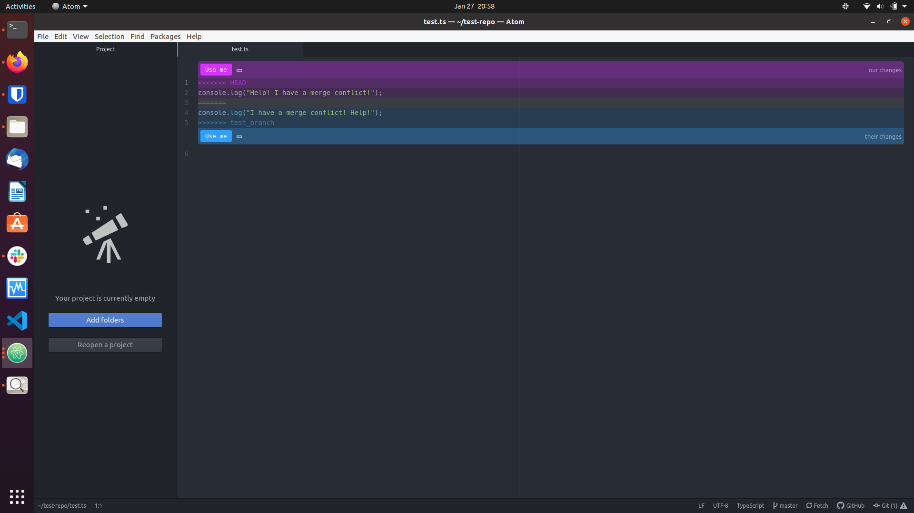

You can just click on the "Use me" button for whichever version you want to
use, which simplifies the process greatly.

For windows, we recommend using TortoiseGit as the mergetool.
1. Download the installer for TortoiseGit from the official [website](https://tortoisegit.org/).
    - 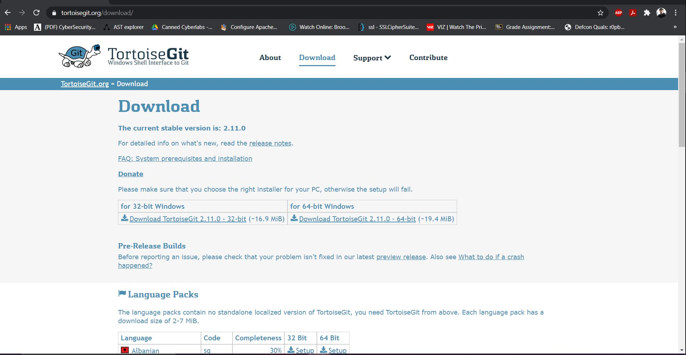
2. Run the installer
3. Select the installation directory and click next on all windows to complete the installation.
4. When attempting to merge conflicts from the CLI, tortoisemerge should be the default option now.
# More Advanced Commands and Fun Stuff

- One of the best shortcuts is using flags for `git commit`. In particular, if
you wish to add all the changed files that are currently being tracked (i.e.
already exist in the main branch), you can use the flag `-a` when committing.
This equates to typing `git commit -am "[Descriptive Message]"` instead of
`git add`ing each file and then committing.

- Sometimes you just mess up your code badly and you want to revert to the
previous commit that was working. To do this, use the `git stash` command.
First, type `git stash`. This command reverts you back to your previous commit
and actually saves your changes locally in a stash (i.e you can get them back).
However, in our example, we just want to dump the bad code, so after `git stash`
type `git stash drop`. Now your bad code breaking changes are gone. Poof!

- Sometimes you might have already pushed your bad code! In order to "undo"
this pushed commit, use `git revert`. Be warned though, this is entering into
the trickier parts of git, and it could really really mess up your code if
you aren't careful. Find the hash of your git commit you want to undo on the
web page commit history. Conveniently, there is a copy button for this hash
for each commit. Alternatively, you can type `git log` and it will show the
commit history (be warned if this is long, you might want to add flags as to
not have to continuously press enter to scroll through it).
Then navigate to your terminal and type `git revert [copied hash]`. This is a
separate commit that undoes the other commit, push this commit, and your bad
code disappears (and has a traceable history associated with the undo in the
commit history). Again, this is a warning that you really could mess up your
code by doing this, and we may not be able to help you fix it. To be on the
safer side, only revert your last commit when you realize you pushed bad or
broken code.

- `Forking` is a form of branching in which you create a local copy of an
existing repo (and use this copy as if it is your own), which can later be
merged like a normal branch using a pull request. This type of process is
usually used in large, open-source projects when developers add features, but
you can use it too! For example, these tutorials are developed on a local fork
that gets merged with the website master repo when we finish a new one!

- Github supports emojis! To use one, consult the list here: https://github.com/ikatyang/emoji-cheat-sheet/blob/master/README.md. Select your favorite and add
the id of the emoji in question to your git commit message. A personal favorite
of one of the authors is `":space_invader:"`. These are fun to add to any
commit, but in particular a `git commit -am "Done!! :space_invader:"` for when
you finish a programming assignment is always fun :)
