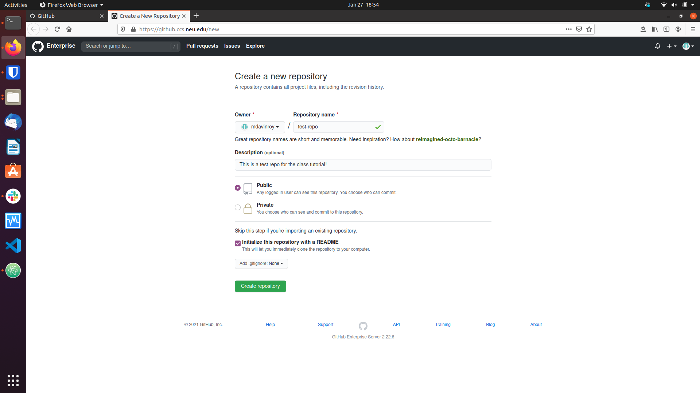

This tutorial describes the basic usage of git, a version control system to
track code changes among yourself and your collaborators.

Contents:
* [Gitting Started!](#gitting-started)
* [Basic Commands](#basic-commands)
* [Branching](#branching)
* [Merging and Various Errors](#merging-and-various-errors)

If you run into any difficulties following any of these steps, please post
(in a non-private question) on Piazza.

# Gitting Started!

Git is a version control system that lets you share versions of code remotely
with other collaborators (or have a remote version you can save and access from
any computer). The central platform that we will be using is an online service
called Github (other services also exist, like GitLab). You can create your own
account online at https://github.com/, or Khoury College has an institutional
Github you can log into with your Khoury account. This website can be found at
https://github.ccs.neu.edu/login. We recommend using the Khoury Github, as this
will be what you will be using for your final projects.

Once you login, you can create a new repository (which is a another name for
a git enabled folder) by clicking "New" button in the upper left corner:
    

Use the screen to enter a new folder (repo) name. For example, I chose
/test-repo. Additionally select Public or Private depending on who you
want to be able to see your project and click add README as well. Then click
"create repository".
    

This should put you on the webpage of the new repository you just created!
    

To get this repository on your local computer, you will do a process called
cloning. Two steps are needed before you can do this process:

1. You need to install git locally on your computer.
2. You need to add an ssh key to your github page (or you can clone using
  https).

For step one, if you are on a linux machine, type `sudo apt-get update` and then
type `sudo apt-get install git`.
If you are on a mac, type `brew install git`. If you are on a windows machine,
`Not sure what to do, insert here`.

After you install git, navigate to your home directory and type `ssh-keygen`.
Press enter for all options, and optionally enter a password when prompted. It
is less secure to not enter a password, but many people opt not to have one
when working on a personal computer to make their workflow easier. Next, on
the Github website, access your account settings, by clicking on the little
icon on the top right and selecting `Settings` from the drop-down menu.
    

Click on the `SSH and GPG keys` tab and click `New SSH-key`. Navigate to your
home directory and type `cat .ssh/id_rsa.pub`. This is your public key, make
sure not to access `.ssh/id_rsa` instead, as this is your private key. Copy
and paste this public key into the box, give it a recognizable title (something
that you would recognize as your computer) and click `Add SSH key`.
    

After you add your ssh key, you are ready to clone the repository locally!
Navigate back to your repo page and locate the green `Code` button with an
arrow. Make sure it says `Clone with SSH` and click the clipboard to copy
the location. Navigate back to your terminal and type
`git clone [copied location]`. Hit enter to accept the SSH prompt (this will
only happen the first time you access a repo). This will clone your repo
locally for you to edit! If you encounter an error saying you do not have
access rights, you have messed something up in adding your ssh key. Retry
the steps for generating and adding the public key to your Github.

# Basic Commands

# Branching

# Merging and Various Errors
