This tutorial describes how to test an API 

Contents:
* [Setting up the transcript Server](#transcript-server)
* [How to use Postman to test an API](#postman-api)
* [How to use CURL to test an API](#curl-api)
* [Testing the transcript server with Postman and Curl](#transcript-postman-curl)
* [How to add routes to the transcript server](#add-routes-server)

# Setting up the transcript Server

To get the project with the transcript server, download the [Example_3.1.zip](../Examples/Example%203.1%20transcript-server.zip) and extract the contents of the zip file to your local machine.

Use your terminal to navigate to the top level directory of the server such that the current working directory is "*/Example_3.1". Use 'npm install' to install necessary dependencies. Use the command 'npm run-script run' to start the server.

The screen should now show the initial list of transcripts for students in the database and the location of the server:

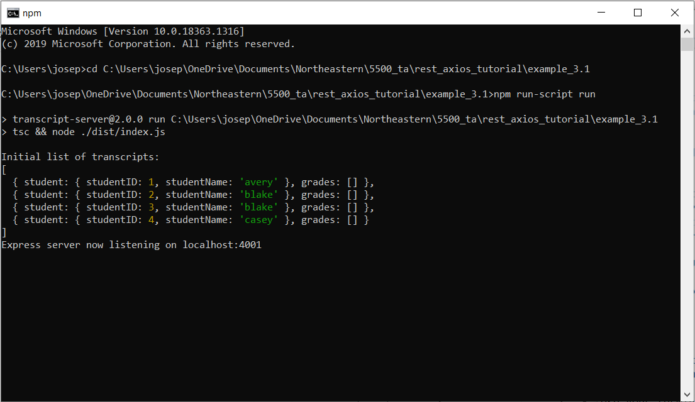
# How to use Postman to test an API

*Note:* Make sure the transcript server is running.

Download the [Postman app](https://www.postman.com/downloads/).

Once you have Postman downloaded, open the application. To start, we will first create a new Workspace. Go to the top left part of the application window and select the "Workspaces" button. In the dropdown, select "New Workspace" and give the workspace a name.

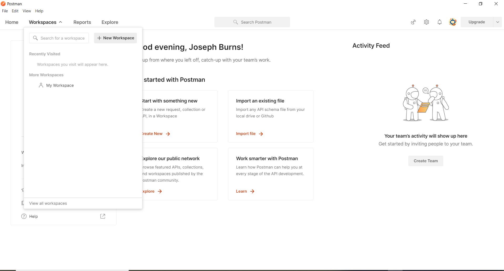

Once you have your workspace, create a new collection by selecting "New" from the left sidebar and selecting "Collection" from the available options. Name the new collection 'typescript-server'. Note that you can choose any name for your collection, and this choice will not effect how the requests are made.

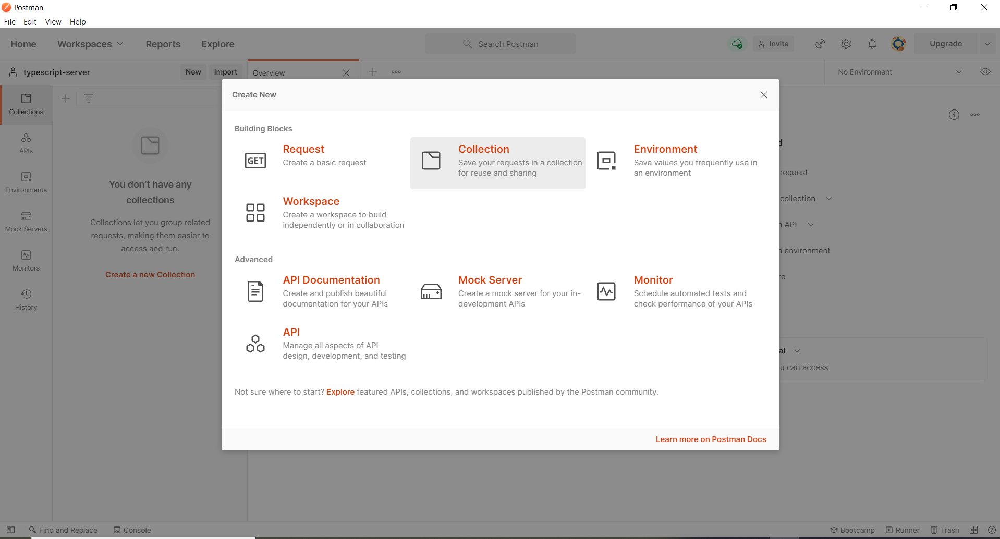

To make a new request, go to "New" and select "New Request". Name the request "Basic Get", as we will be getting the root resource from the server, sometimes noted as a simple backslash ('/'). Attach this request to the 'typescript-server' collection we created.

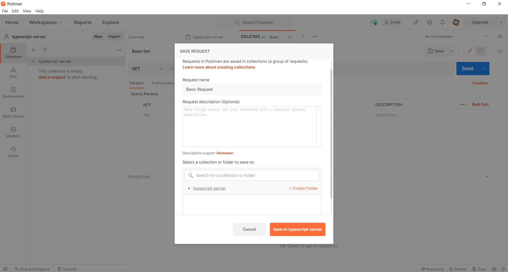

In the top section of the screen, there is a text-entry bar with a dropdown on the right side that lets you select GET, POST, PUT, DELETE, as well as several other possible HTTP commands you might use to interact with the server. Leave the current action as GET for now. 

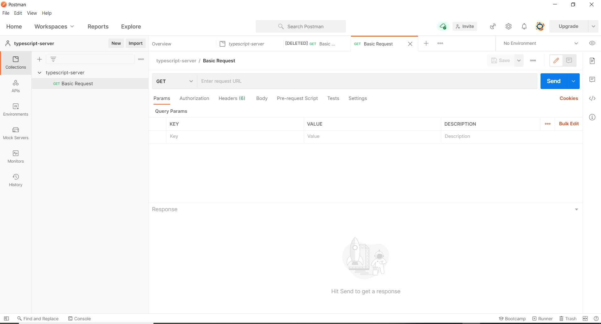

In the text-entry field next to the dropdown, enter 'localhost:4001/'. Once you have this entered into the field, click the 'Send' button. 

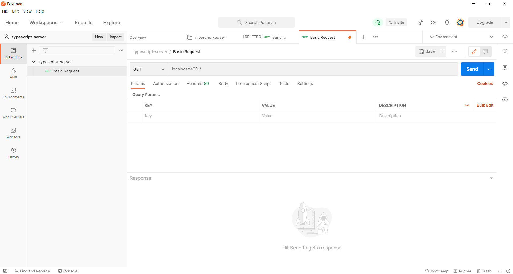

The bottom portion of the screen should now contain the statement "This is GET number 1 on the current server".

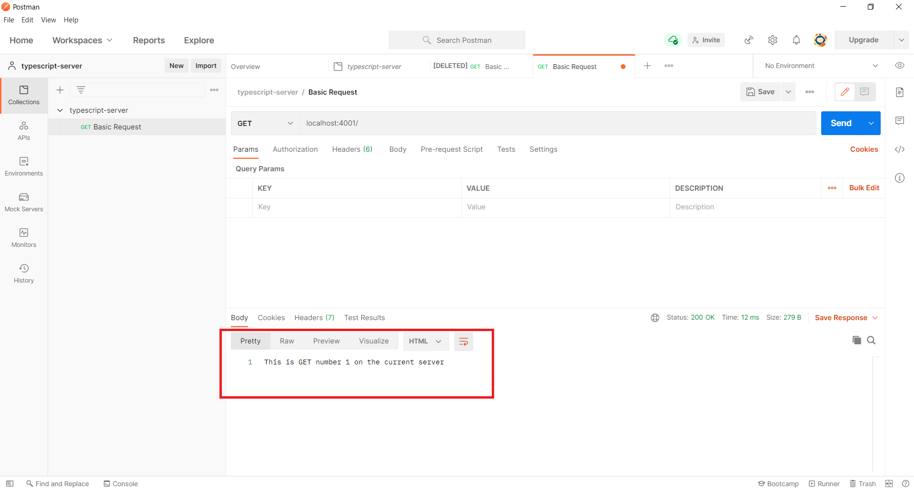

If you go back to the terminal running your server, you should see 'Handling GET/ 1' printed to the screen.

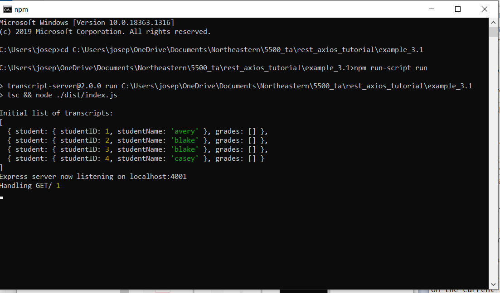

For more requests, check out the section on [Testing the transcript server with Postman and Curl](#transcript-postman-curl)

# How to use CURL to test an API

Installing Curl

- For Windows: Install Git and Git Bash as given in the [git tutorial](./week2-git.md).
- For Linux: Open a terminal and Run the command: `*sudo apt-get install -y curl*`.
- For MAC: Open a terminal and Run the command: `*brew install curl*`.

Open *git bash* on Windows or a *terminal* on Linux/Mac.

Verify that Curl is installed using the command `*curl --help*`.

All the following commands will be run in the same terminal.

Let us start by making a simple get request to the root resource from the server, sometimes noted as a simple backslash ('/').
In order to do this, run the command: 
- `*curl -i http://localhost:4001/*`

*Note:* The flag *-i* is optional and is used to display additional information such as headers.

If you go back to the terminal running your server, you should see 'Handling GET/ 1' printed to the screen.

For more requests, check out the section on [Testing the transcript server with Postman and Curl](#transcript-postman-curl)

# Testing the transcript server with Postman and Curl

Now that we have made a basic get request using Postman and Curl, let us explore the other routes of our server.

## GET /transcripts

### With Postman
- Return to the Postman application. Create a new request and name the request "Get Transcripts". Like the previous request, leave the server action as GET, except this time put "localhost:4001/transcripts" in the text-entry field. 
	 - 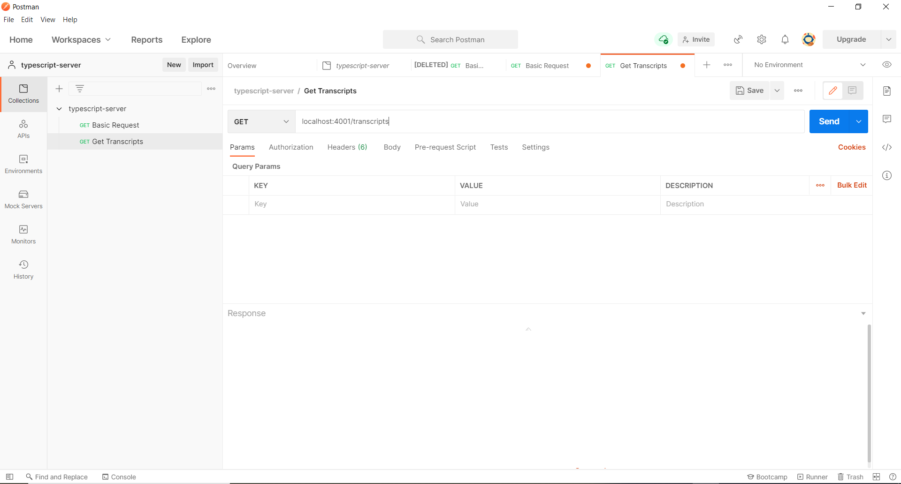

- Once you have this entered, click "Send". In the bottom part of the screen, you should see the server returned 4 JSON objects corresponding to 4 students in the the class. Each object contains the student's ID and the student's name under an object named "student", and the student's grade as a collection corresponding to a field named "grades". 
	 - 

### With Curl
- Run the following command in curl to make a GET request to the "/transcripts" route:
	 - Command: `*curl -X GET http://localhost:4001/transcripts*`.
	    - *Note:* `*-X GET*` is used to specify the request type as GET (default is GET).
	 - you should see the server returned 4 JSON objects corresponding to 4 students in the the class. Each object contains the student's ID and the student's name under an object named "student", and the student's grade as a collection corresponding to a field named "grades".
	 - 

### Result on the server
- If you return to the server, you should see the statement "Handling GET/transcripts" along with a collection of objects corresponding to the JSON object in the Postman server.
	 - 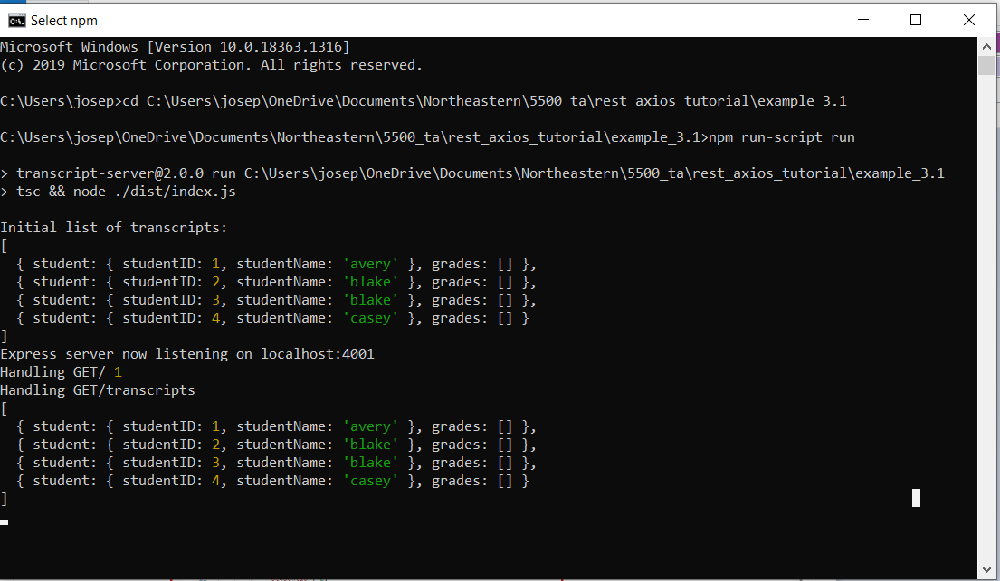

## POST /transcripts

- Now, we're going to make a Post request to the server to add a new student to the database. 

### With Postman
- Return to the Postman application. Create a new request and name the request "Post New Student". 
- On the new request, go to the action drop down and change the action from GET to POST. In the text-entry field, enter 'localhost:4001/transcripts'. 
- Now, beneath the text entry field, there are several options: Params, Authorization, Headers, Body, Pre-request Script, Tests, and Settings. We want to work with the body of the request, so select the Body option. The Body interface will offer you several formats to enter your data; we are going to use x-www-form-urlencoded.
- A new form should appear with fields for Key, Value, and Description. Under Key, enter "name". Under Value, enter the name of the student you would like to add. Note, you do not need quotes for these values. Leave Description empty.
	 - 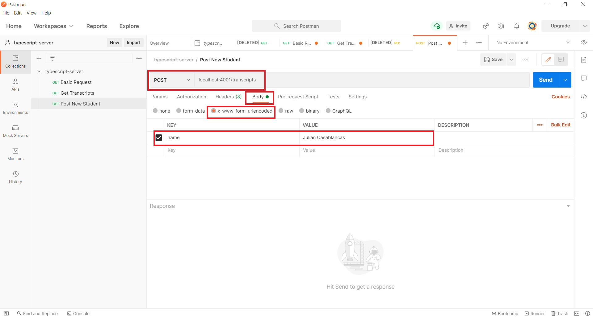
- The server should respond with a JSON object with an entry "studentID" and the id number for the new student. Remember this id number, we are going to use it later.
	 - 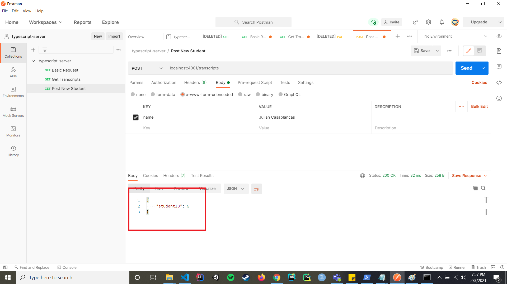

### With Curl
- Run the following command in curl to make a POST request to the "/transcripts" route:
	 - Command: `*curl -X POST -H "Content-Type: application/x-www-form-urlencoded" -d "name=Julian Casablancas" http://localhost:4001/transcripts*`.
	    - *-X POST*: Sets the request type as POST.
			- *-H Content-Type: application/x-www-form-urlencoded*: Adds the header to set Content-Type to x-www-form-urlencoded(which is the default). Use *application/json* for JSON body.
			- *-d "name=Julian Casablancas"*: Represents the request body in url encoded format.
	 - The server should respond with a JSON object with an entry "studentID" and the id number for the new student. Remember this id number, we are going to use it later.
	 - 

### Result on the server
- If you go back to the terminal running the typescript server, you should see a message "Handling POST/transcripts name=<name you entered>, id=<student ID number>". You have successfully added the student to the database connected to the typescript server.
	 - 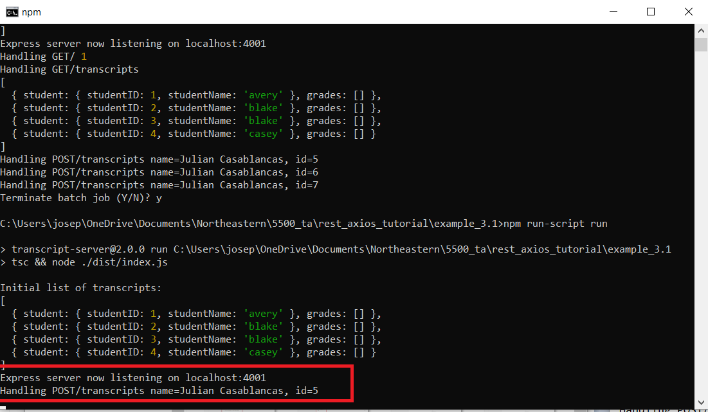

- To verify the student has succesfully been added to the database, return to the Postman application and select our previous request "Get Transcripts" or make a get request using curl. Run this request again, and this time you should see your new student in the JSON object returned by the server.

## DELETE /transcripts

- Now, we are going to delete our new student.

### With Postman

- In Postman, create a new request and name the request "Delete Student".
- In this request, we are going to change the action from GET to DELETE in the action dropdown. In the text entry field, we are going to enter "localhost:4001/transcripts/&lt;number&gt;" where &lt;number&gt; is the id of the student you added to the server database in the previous step (5 in our example). 
	 - 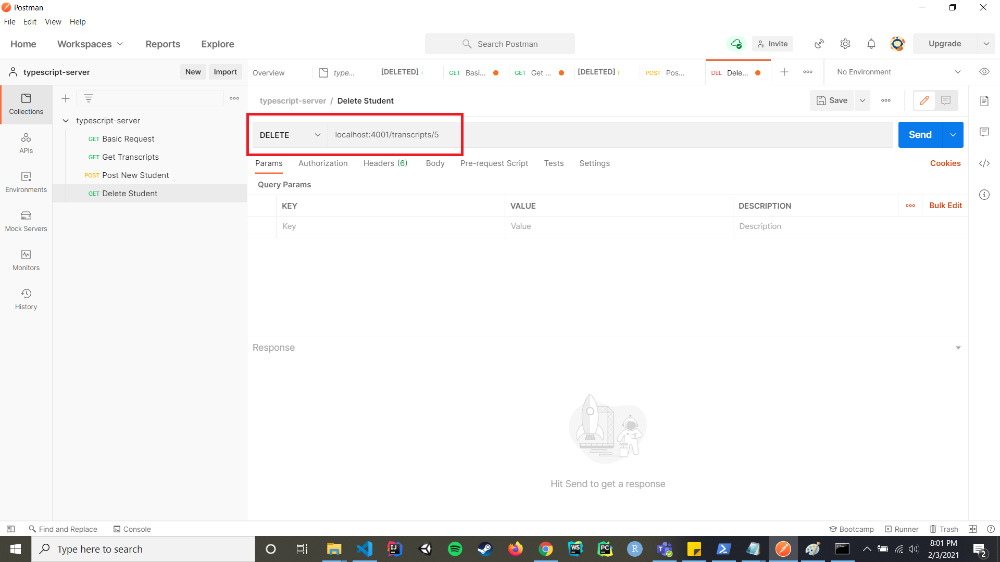
- Once you have this entered, click "Send". The server should respond with "OK" in the bottom part of the Postman app.
	 - 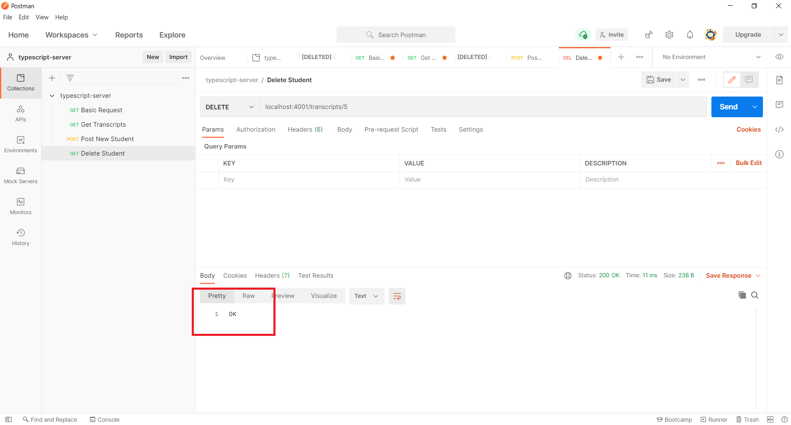

### With Curl

- Run the following command in curl to make a DELETE request to the "/transcripts" route:
	 - Command: `*curl -X DELETE http://localhost:4001/transcripts/5*`.
	    - *-X DELETE*: Sets the request type as POST.
			- *5*: Represents the ID of the student to delete.
	 - The server should delete the student and respond with "OK".
	 - 

### Result on the server
- If you return to the terminal running the server, you should see the message "Handling DEL /transcripts, id = 5".
	 - 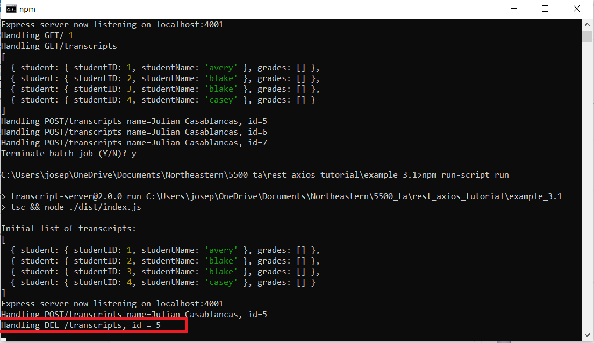

# How to add routes to the transcript server

To better understand how the server is serving these requests, look at index.ts in the example_3.1 project files. The server is using the Express library to serve the requests. The local variable 'app' is how the server interacts with requests made from Postman. For example, app.get('/transcripts' (req, res) => { on line 59 is how we get the transcripts from a request to our API. 

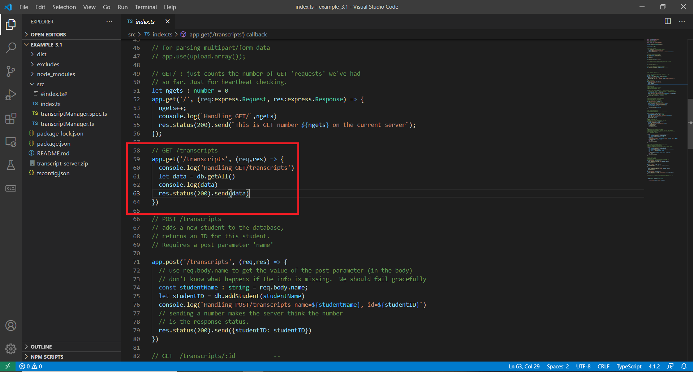

The behavior defined in the internal anonymous function for this request is what is returned to the client. The rest of our calls work the same way. Try looking at some of the other resources and use Postman to get information, post information, or delete information from the server!
