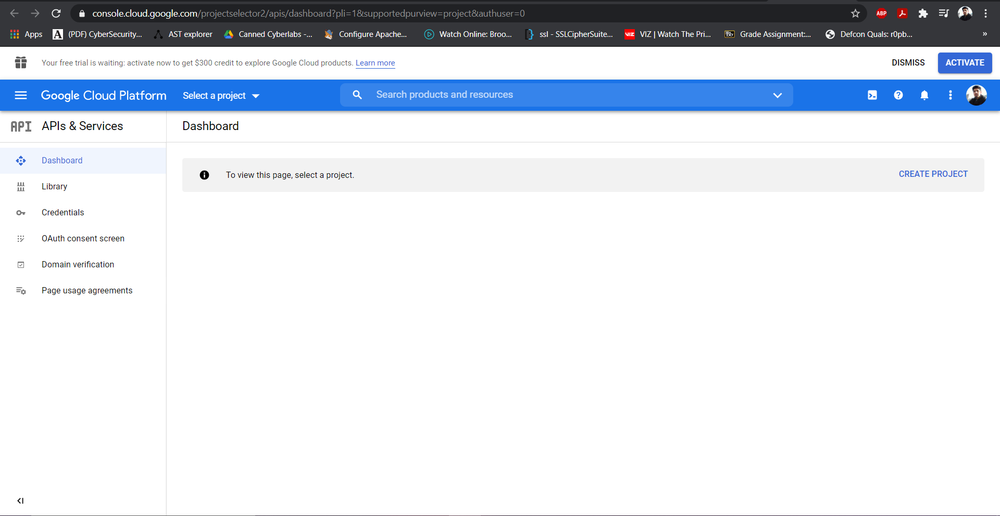
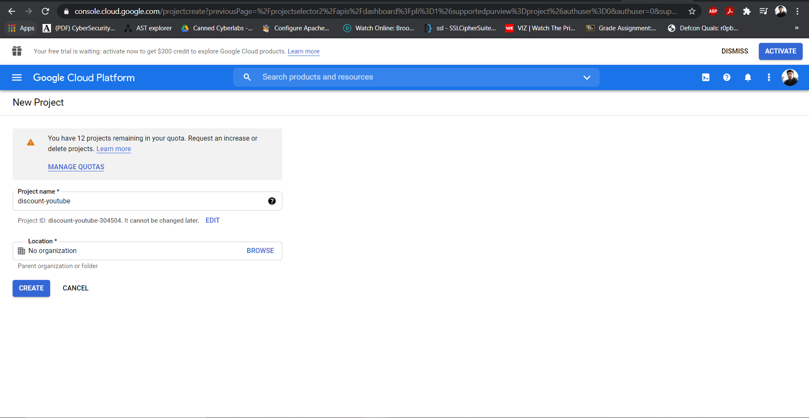
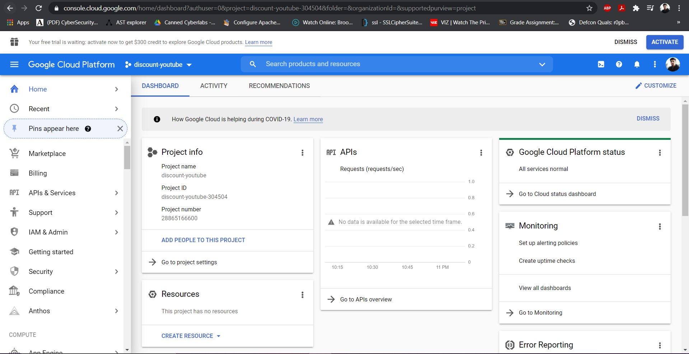
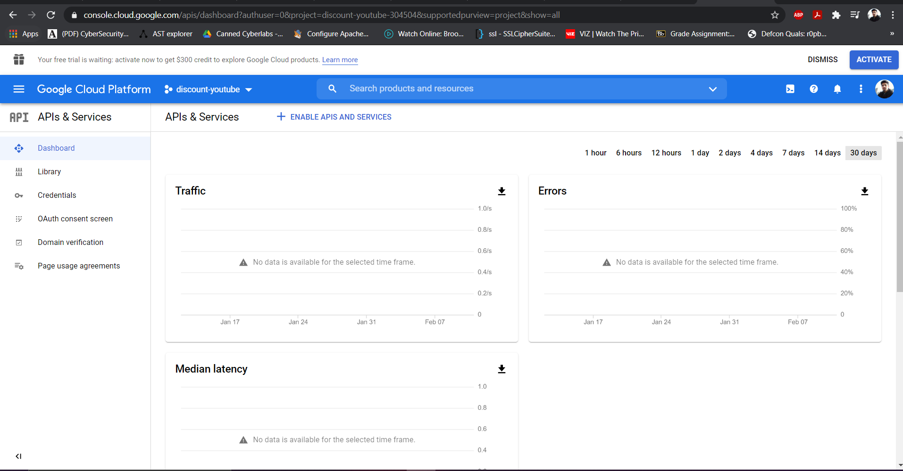
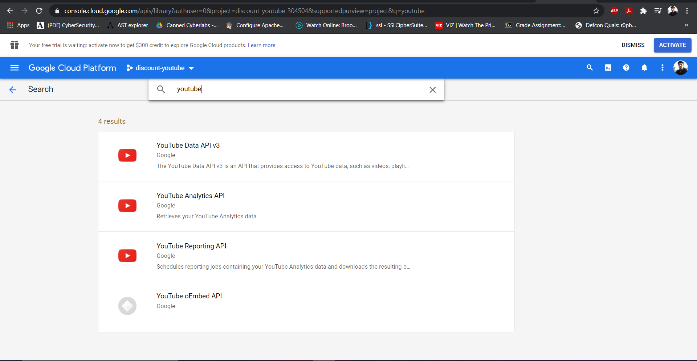
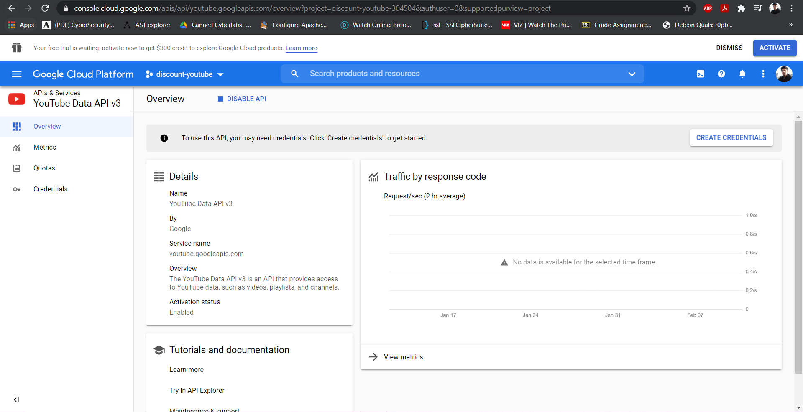
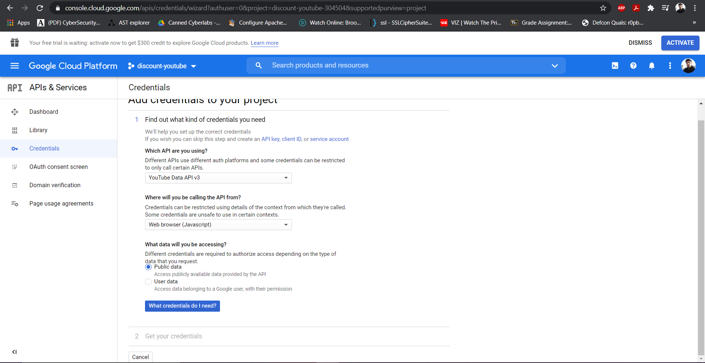
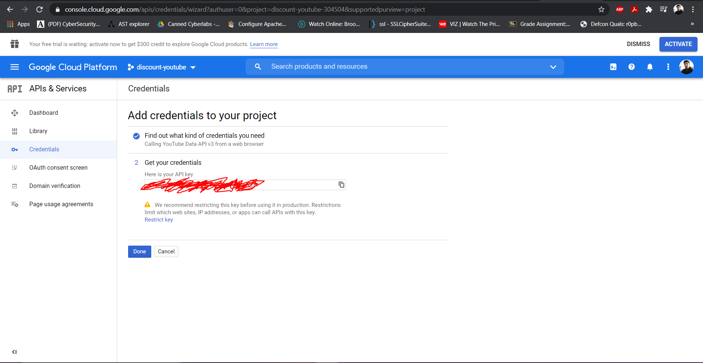

This tutorial gives a basic introduction to promises and using axios to make http requests. In this tutorial, we will cover examples using the file system module to understand asynchronous behaviour with promises, promise chaining, and parallel requests. Finally, we will use the axios module to make http requests to the YouTube API.

Contents:
* [Promise Basics](#promise-basics)
* [Application Setup](#app-overview)
* [Promise Examples](#promise-examples)
* [YouTube API Examples](#youtube-api-examples)

# Promise Basics

In JavaScript [and TypeScript], certain tasks can be performed asynchronously on background threads such as I/O operations, network requests, and timers. The different constructs available to handle such asynchronous events are callbacks, promises. Due to various problems associated with callbacks (such as callback hell), promises are the preferred construct for handling asynchronous behavior. In simple terms, a promise is a function telling the caller, "I don't have what you need just yet, but I'm going to fetch that data and I *promise* to get back to you once I do; *then* you can process the data". There is also a relatively newer way of handling promises which processes them synchronously within the given closure called async/await.

Looking at the code examples below should give a comparison between synchronous and asynchronous behavior.

- Example: Synchronous code:
   - ```ts
      function doSomething() {
         console.log('I always execute first.');
         someSynchronousFunction(); 
         // The above line will perform some tasks and the code stops here while it does so.
         console.log('I always execute after the synchronous function.');
      }
   ```

- Example: Asynchronous function:
   - ```ts
      function doSomething() {
         console.log('I always execute first.');
         someAsynchronousFunctionWhichReturnsAPromise()
            .then((data) => {
               // This function will execute one the async task has completed.
               console.log('This is the data you wanted: ', data);
               console.log('I will get printed last');
            });
         console.log('I execute right after the Async task starts executing');
      }
   ```

- Example: Async/Await
   - ```ts
      async function doSomething() { // This function now returns a promise because it is "async"
         console.log('I always execute first.');
         const data = await someAsynchronousFunctionWhichReturnsAPromise(); 
         // The above line will perform some tasks and the code stops here while it does so.
         console.log('This is the data you wanted: ', data);
         console.log('I will get printed last');
      }
   ```

# Application Setup

Let us create a simple typescript application to work with promises. To do this, follow the below steps:

1. Open a terminal in the directory where you wish to create a new project.
2. Install the global npm package Simple Typescript Starter using the command:
   - `*npm install -g simple-typescript-starter*`
3. Generate a new project called promises using the command below:
   - `sts generate promises`
   - This creates a new project called promises
4. Navigate to the promises directory
5. Run the below command to run the code:
   - `*npm start*`
   - It should print out "It Works!".
6. The project is now set up

# Promise Examples

Let us implement some examples to understand how promises work and behave. As we know, promises are used for asynchronous tasks and a simple example of this is reading files from disks. Let us use the built-in NodeJS module for file system to explore promises.

*Note:* We will work in the file "src/index.ts". Before we get started, remove all the existing code from that file.

## Getting started 

- To get started with reading file, let us start by creating some files that we can read.
- In the "src" directory, create a new directory called "test-files".
- Add a few .txt files to this directory with any content in it.

## Using fs functions

- In order to use fs functions, we need to import the fs module in index.ts as below:
   - ```ts
      import * as fs from 'fs';
     ```
- The syntax for reading a file is as below:
   - ```ts 
      fs.promises.readFile('/path/to/file', 'utf8');
     ```
   - This function returns a promise containing the contents of the file.

## Simple promise example

Let us start by Asynchronously reading a file.
1. Import fs into index.ts as shown above.
2. As we know, we can read a file using `fs.promises.readFile('/path/to/file', 'utf8');`, but in order to access the results of a promise, we need to call the .then() method.
3. Thus, to read the contents of the file, let us add a promise handler as below:
   - ```ts
      fs.promises.readFile('./src/test-files/filename', 'utf8')
        .then((data) => {
          console.log('The contents of the file are: ', data);
        });
     ```
4. Save the file and run the command:
   - `*npm start*`
   - The contents of the file should be printed out now.
5. To better understand how asynchronous behavior works, let us add a couple more console.log statements and observe how they behave:
   - ```ts
      console.log('I execute first');
      fs.promises.readFile('./src/test-files/filename', 'utf8')
        .then((data) => {
          console.log('The contents of the file are printed last: ', data);
        });
      console.log('I execute second');
     ```
6. Save the file and run the command:
   - `*npm start*`
7. Thus, JS follows run-to-completion semantics and promise handlers are only executed after the current context completes.

### Making things pseudo-synchronous with async/await.

The async/await syntax allows us to use promises as if they were synchronous using async/await syntax within an async function.
The above code can be written as below:

- ```ts
    async function asyncFileRead() {
      console.log('I run second');
      const data = await fs.promises.readFile('./src/test-files/filename', 'utf8');
      console.log('The contents of the file are printed fourth: ', data);
    }

    console.log('I run first');
    asyncFileRead()
      .then(() => {
        console.log('I run last');
      });
    console.log('I run third');
  ```

### Error Handling with Promises

In order to handle errors in promises, we need to use the .catch() function, which can be invoked similar to a .then().
Assuming we used an incorrect file path, and the file cannot be found, the readFile function will throw an error. Let us catch this error with a .catch block.

- ```ts
   fs.promises.readFile('./src/test-files/file-that-doesnt-exist', 'utf8')
        .then((data) => {
          console.log('The contents of the file are: ', data);
        }).catch((error: Error) => {
           console.log('readFile failed because: ', error.message);
        });
  ```

For async/await we can use a try/catch block to catch the error

- ```ts
   async function asyncFileRead() {
      try {
         const data = await fs.promises.readFile('./src/test-files/filename', 'utf8');
      } catch(error) {
         console.log('readFile failed because: ', error.message);
      }
    }
  ```
## Nested Promises

In certain cases, we may want to perform certain asynchronous actions one after the other. This can be achieved by nesting promises.
For example, suppose we want to read a directory and then read the first file we find in that directory.

1. We can read the directory as below:
   - ```ts
      fs.promises.readdir('/path/to/dir');
     ```
   - This function returns a promise containing an array of files in the directory.
2. Let us now write a promise to read the list of files returned.
   - ```ts
      fs.promises.readdir('./src/test-files')
        .then((fileList) => {
          console.log('Filelist: ', fileList);
        });
     ```
3. Now, we can read the file as we previously did, but inside the promise resolution for readdir:
   - ```ts
      fs.promises.readdir('./src/test-files')
        .then((fileList) => {
          console.log('Filelist: ', fileList);
          fs.promises.readFile('./src/test-files/' + fileList[0], 'utf8')
            .then((data) => {
              console.log('The contents of the file are printed last: ', data);
            });
        });
     ```
    - Although this works, the solution is not very readable and difficult to follow.
    - Promises allow us to return another promise and chain them. This will enable us to flatten the above structure.
4. Let us chain the promises to improve out solution:
   - ```ts
      fs.promises.readdir('./src/test-files')
        .then((fileList) => {
          console.log('Filelist: ', fileList);
          return fs.promises.readFile('./src/test-files/' + fileList[0], 'utf8')
        }).then((data) => {
          console.log('The contents of the file are printed last: ', data);
        }).catch((error) => {
           console.log('Error thrown by any promise above will be caught here: ', error.message);
        });
     ```
5. Save the file and run the command:
   - `*npm start*`
### Making things pseudo-synchronous with async/await.

With async/await, the code would look as below:

- ```ts
    async function asyncFileRead() {
      const fileList = await fs.promises.readdir('./src/test-files');
      const data = fs.promises.readFile('./src/test-files/' + fileList[0], 'utf8');
      console.log('The contents of the file are: ', data);
    }

    asyncFileRead()
      .then(() => {
        console.log(done);
      });
  ```

## Running Promises in Parallel

In certain cases, we may want to execute multiple promises in parallel. This may be making various network requests or reading files, and can be achieved using the function Promise.all();
The promise.all() function allows us to create an array of promises and perform some action when all the promises have resolved.

Building on the above example, let us try to read all files from the directory in parallel.
This can be done as below:
- ```ts
    async function asyncFileRead() {
      const fileList = await fs.promises.readdir('./src/test-files');
      const promises = [];
      fileList.foreach(file => {
        promises.push(fs.promises.readFile('./src/test-files/' + file, 'utf8')
          .then((data) => {
            console.log('Completed reading file: ', file);
            return data;
          });
        );
      });
      return Promise.all(promises)
         .catch((error) => {
            console.log('Any promise that fails in the array above gets caught here: ', error.message);
         });
    }

    asyncFileRead()
      .then((data) => {
        // Data is an array of values returned by each promise in the promises array.
        // data[0] contains the contents of file fileList[0].
      });
  ```

# YouTube API Examples

Let us make some network requests which also return promises. We will use the module "axios" for this and connect to the YouTube API.
- Install the axios module by running the command:
   - `*npm install --save axios*`
- Import the axios module to index.ts as below:
   - `import axios from 'axios`;

We will make 2 get requests to the youtube API
1. Get the video search results for a search term
2. Get comments on a youtube video.

## Generating Your Own API Key

In this tutorial, we are using the Youtube API v3, provided by google. In order to use this, Google provides a free API key which can be used to make 10,000 requests per day. This tutorial also assumes you have a google account, if you do not have one, please create one before you proceed. This involves 2 steps:
1. Create a Project
2. Enable API and generate key

### Creating a new Project

1. Navigate to [Google developer console](https://console.developers.google.com/) and log in if required.
   - 
2. Click on "Create Project".
3. Add in the necessary information as below.
   - 
4. Click on "Create".
   - This will create a new project for which we can create an API key.
5. This will open the new project by default.
   - If not, select the recently created project
   - 


### Enable API and generate key

1. Select the new project created. (if not already open)
2. Click on "Go to APIs Overview" in the API section.
3. Click on "Enable APIs and Services" at the top.
   - 
4. Search youtube and select "Youtube Data API v3"
   - 
5. Click Enable. This will redirect you to the youtube api home page.
   - 
6. Click on "Create Credentials".
7. Configure the details as shown below.
   - youtube api v3
   - web browser (javascript)
   - public
   - 
8. Click on "what credentials do I need?" and your key is ready!
   - 
9. Copy this key for use in your applications.


## Fetching search results

1. In order to get the search results from youtube, we need to do the following:
   - We need to make a GET request to "https://www.googleapis.com/youtube/v3/search".
   - Pass the search term as a query parameter called "q".
   - Pass 'snippet' as a query parameter called "part".
   - Pass '10' as a query parameter called "maxResults". (to fetch only 10 results at a time)
   - Pass the API key as a query parameter called "key".
2. We can make a GET request using axios as below:
   - ```ts
      axios.get('my url', { options });
     ```
   - This request will return a promise.
3. Add the below code to make the desired request to youtube to the "searchYoutubeVideos" function:
   - ```ts
      axios.get('https://www.googleapis.com/youtube/v3/search', {
        params: {
          part: 'snippet',
          maxResults: 10,
          key: 'Your api key goes here', // Make sure you update this!
          q: 'Javascript event loop explained'
        }
      });
     ```
4. This will return a promise with a response containing the below schema:
   - ```ts
      {
        "kind": "youtube#searchListResponse",
        "etag": etag,
        "nextPageToken": string,
        "prevPageToken": string,
        "regionCode": string,
        "pageInfo": {
          "totalResults": integer,
          "resultsPerPage": integer
        },
        "items": [
          {
            "kind": "youtube#searchResult",
            "etag": etag,
            "id": {
              "kind": string,
              "videoId": string,
              "channelId": string,
              "playlistId": string
            },
            "snippet": {
              "publishedAt": datetime,
              "channelId": string,
              "title": string,
              "description": string,
              "thumbnails": {
                (key): {
                  "url": string,
                  "width": unsigned integer,
                  "height": unsigned integer
                }
              },
              "channelTitle": string,
              "liveBroadcastContent": string
            }
          }
        ]
      }
     ```
5. Next we need to print the returned search results (the items array) to console. Since this is a promise, we need to use the .then() function.
   - ```ts
      axios.get('https://www.googleapis.com/youtube/v3/search', {
        params: {
          part: 'snippet',
          maxResults: 10,
          key: 'Your api key goes here', // Make sure you update this!
          q: searchTerm
        }
      }).then(response => {
        console.log(response.data.items); // setState is React stuff and can be ignored for now.
      });
     ```
6. Save the file.
7. In the terminal, run `*npm start*`.

## Fetching the Comments on a video

1. Notice axios is already imported in the file on line 3.
2. In order to get the comments related to a video, we need to do the following:
   - We need to make a GET request to "https://www.googleapis.com/youtube/v3/commentThreads".
   - Pass the video ID as a query parameter called "videoID".
   - Pass 'snippet' as a query parameter called "part".
   - Pass '10' as a query parameter called "maxResults". (to fetch only 10 results at a time)
   - Pass the API key as a query parameter called "key".
3. We can make a GET request using axios as below:
   - ```ts
      axios.get('my url', { options });
     ```
   - This request will return a promise.
4. Add the below code to make the desired request to youtube to the "getAllComments" function:
   - ```ts
      axios.get('https://www.googleapis.com/youtube/v3/commentThreads', {
        params: {
          part: 'snippet',
          videoId: '8aGhZQkoFbQ',
          maxResults: 10,
          key: 'Your api key goes here', // Make sure you update this!
        }
      });
     ```
5. This will return a promise with a response containing the below schema:
   - ```ts
      {
         "kind": "youtube#commentThreadListResponse",
         "etag": etag,
         "nextPageToken": string,
         "pageInfo": {
            "totalResults": integer,
            "resultsPerPage": integer
         },
         "items": [
            {
               "kind": "youtube#commentThread",
               "etag": etag,
               "id": string,
               "snippet": {
                  "channelId": string,
                  "videoId": string,
                  "topLevelComment": comments Resource,
                  "canReply": boolean,
                  "totalReplyCount": unsigned integer,
                  "isPublic": boolean
               },
               "replies": {
                  "comments": [
                     comments Resource
                  ]
               }
            }
         ]
      }
     ```
6. Next we need to extract the commments and print them to console. Let us use the async/await syntax as below: 
   - ```ts
      async function getComments() {
          const commentThreads = await axios.get('https://www.googleapis.com/youtube/v3/commentThreads', {
          params: {
            part: 'snippet',
            videoId: this.props.video.id.videoId,
            maxResults: 10,
            key: 'Your api key goes here', // Make sure you update this!
          }
        });
        const comments = commentThreads.data.items.map(comment => { return {
            textDisplay: comment.snippet.topLevelComment.snippet.textDisplay, 
            id: comment.snippet.topLevelComment.id,
            img: comment.snippet.topLevelComment.snippet.authorProfileImageUrl,
            author: comment.snippet.topLevelComment.snippet.authorDisplayName, 
          };
        });
        console.log(JSON.stringify(comments, null, 2));
      } 
      getComments();
     ```
8. Save the file.
9. In the terminal, run `*npm start*`.

## Using Defaults in Axios

Let us take another look at the two requests we wrote in the previos section.
- ```ts
      axios.get('https://www.googleapis.com/youtube/v3/search', {
         params: {
            part: 'snippet',
            maxResults: 10,
            key: 'Your api key goes here', // Make sure you update this!
            q: searchTerm
         }
      });

      axios.get('https://www.googleapis.com/youtube/v3/commentThreads', {
         params: {
            part: 'snippet',
            videoId: this.props.video.id.videoId,
            maxResults: 10,
            key: 'Your api key goes here', // Make sure you update this!
         }
      });
  ```
Comparing the two code snippets above, we can see a few parameters which are common to both requests.
- The base URL is same for both requests: (https://www.googleapis.com/youtube/v3)
- The following query parameters are common:
    - `part: 'snippet'`
    - `maxResults: 10`
    - `key: API_KEY`

We can configure axios to use a default base configuration for all requests. This helps to reduce code duplicity and organize the code better. In order to do this in our application, we need to follow the below steps:

1. axios.create({}) function creates an axios object with the desired base configuration.
2. Let us add an axios default called youtube as below:
    - ```ts
      const youtube = axios.create({
         baseURL: 'https://www.googleapis.com/youtube/v3',
         params: {
            part: 'snippet',
            maxResults: 10,
            key: 'Your API key goes here' // Your API key goes here
         }
      });
     ```
   - Now we have an axios client with default parameters configured. Let us use this in our code.
   - *Note:* This should be at the top of the file after the import statements.
3. Replace the call to `axios.get('https://www.googleapis.com/youtube/v3/search')`:
    - From:
      ```ts
         axios.get('https://www.googleapis.com/youtube/v3/search', {
            params: {
               part: 'snippet',
               maxResults: 10,
               key: 'Your API key goes here', // Your API key goes here
               q: searchTerm
            }
         })
      ```
    - To:
      ```ts
         youtube.get('/search', {
            params: {
               q: searchTerm
            }
         })
      ```
7. Make a similar change for getting comments.

